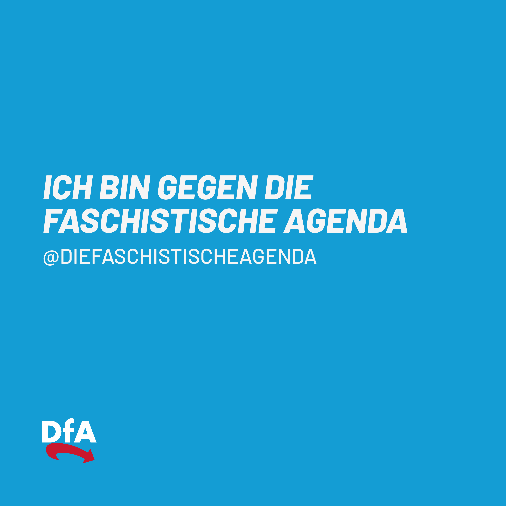
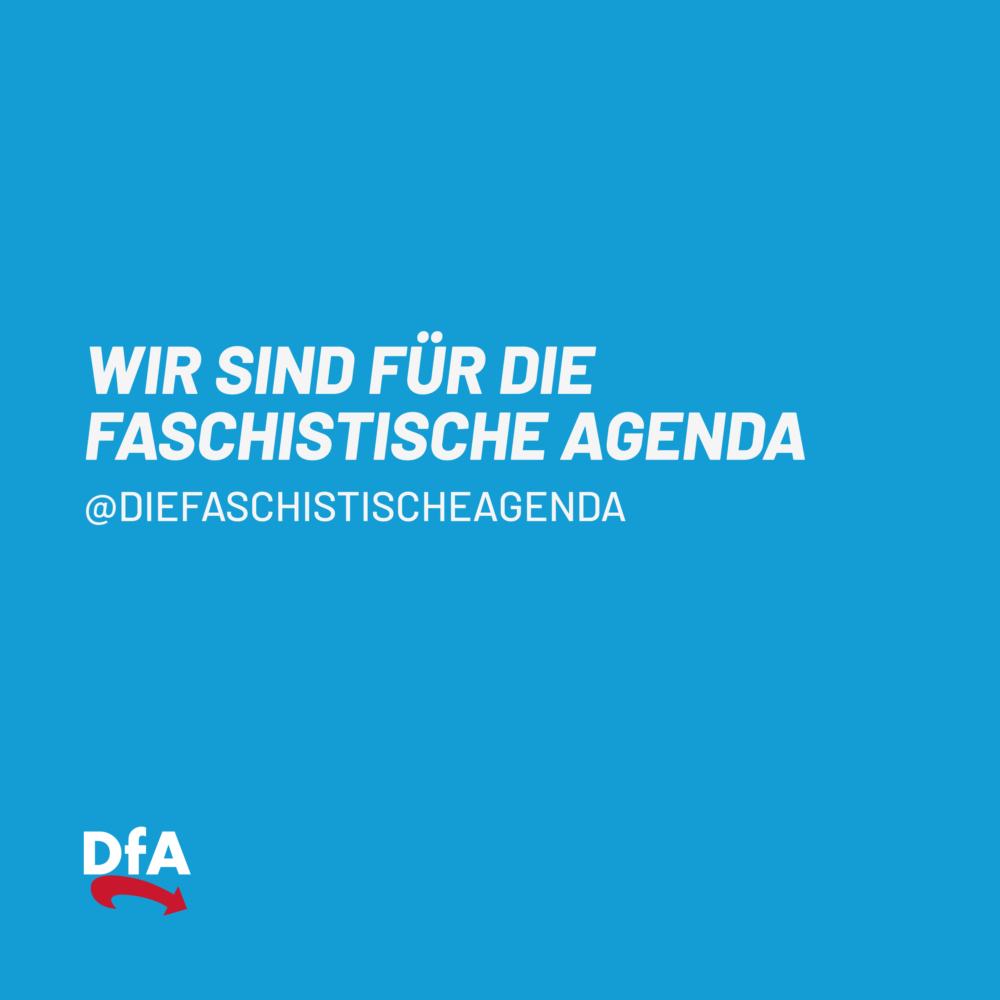

Der Ratgeber für alle Superreichen und die, die es werden wollen.
Der Weg zur Sicherung und Vermehrung von Vermögen durch Destabilisierung der Gesellschaft.

# 1. Vermögens Aufbau

Der Aufbau ist soweit sehr simpel und kann durch verschiedene Wege erfolgen:

1. Mit Abstand die am häufigsten verwendete Methode: In eine reiche Familie geboren werden. (sehr schwierig zu beeinflussen)
1. Als Unternehmer durch Ausbeutung von Menschen und des Planeten reich werden und somit profiteur und automatisch Teil der faschistischen Agenda werden.
1. Als gewählter Vertreter des Volkes gegen Bezahlung im Interesse der faschistischen Agenda handeln.

Natürlich ist es leichter, wenn gleich mehrere dieser Punkte auf dich zutreffen.

# 2. Vermögens Sicherung

Wie kannst du dein Vermögen sichern? Ganz einfach: Indem du die Gesellschaft destabilisert. Wie hat das in der Geschichte geklappt? Mit Faschismus!
Wissen wir wie der geht? Ja!

## Regel Nummer 1: Die Warheit ist euer Feind

- Vermeide jegliche Argumentation mit Statistiken, Fakten oder der Wahrheit. Der Staat kennt eure Identität, weiß, wie viel Geld ihr habt und wie wenig Steuern ihr dafür zahlt. Ihr besitzt objektiv mehr Geld, als [Menschenwürdig](https://www.gesetze-im-internet.de/gg/art_1.html) vertretbar ist. Unter keinen Umständen solltet ihr auf die realen Tatsachen zu sprechen kommen.

Wichtige Maßnahmen:

- Kriminalisiere Whistleblower oder Menschen die versuchen freie Informationen zu verbreiten.
- Versucht Gesetze zu etablieren die es schwerer machen unbemerkt Informationen zu verbreiten
  - [NetzDG](https://de.wikipedia.org/wiki/Netzwerkdurchsetzungsgesetz)
  - [EU Chat Control](https://fightchatcontrol.eu/)

Zur Realtität der Ungleicheit: [https://ungleichheit.info/](https://ungleichheit.info/)

Dein Reichtum bleibt bestehen und vermehrt sich wenn das aktuelle demokratische System eine Balance zwischen den folgenden Punkten schafft.

- Grundsicherung: Das Volk sollte gerade genug Geld haben, damit kein ziviler Ungehorsam entsteht.

  - Beispiele:
    - [Gelbwesten Bewegung](https://de.wikipedia.org/wiki/Gelbwestenbewegung)
    - [Chiles Proteste 2019–2021](https://de.wikipedia.org/wiki/Proteste_in_Chile_2019/2020)
    - [Venezolanische Proteste 2014–2017](https://de.wikipedia.org/wiki/Proteste_in_Venezuela_seit_2014)
    - [Französische Revolution](https://de.wikipedia.org/wiki/Franz%C3%B6sische_Revolution)

- Anstieg aller Kosten des täglichen Lebens bei gleichbleibenden oder sinkenden Löhnen.
<!-- - Hier könnten Beispiele von Mietpreisen, einkommen und GDP folgen -->

Dieser Schritt erfordert enorm viel Feingefühl. Zu wenig Druck auf die Gesellschaft und diese hat genug Zeit für ordentliche Bildung, Organisation und Kunst.
Zu viel Druck auf die Gesellschaft und diese wird sich schlussendlich gegen euch wenden.

Historisch gesehen Wissen wir, dass dieser Seiltanz immer im totalen Faschismus endet. Im besten Fall zögert ihr den Moment des in sich selbst zusammenfallenden Systems so lange wie möglich hinaus.

## Regel Nummer 2: Findet die Größte Minderheit

Um die erste kritische Masse zu erreichen braucht ihr eine Minderheit die derzeit schon unter dem aktuellen System leidet. Diese zu instrumentalisieren hat 2 Vorteile:

1.  Diese Minderheit hat das Gefühl für sich einzustehen und arbeitet quasi umsonst für euch, aber damit hattet ihr ja noch nie ein Problem.
2.  Niemand wird ihnen mehr zuhören wenn sie sagen: "Das System funktioniert nicht für uns." Weil alle Lösungen die sie anbieten halt nicht zum rest der Gesellschaft passen.

Hier müsst ihr in Deutschland zum Glück nicht von vorne anfangen sondern könnt direkt an die kürzlich erst erfolgreiche Vereinigung von Ost und West anknüpfen. Die soziale Ungleichheit gepaart mit den kulturellen Unterschieden zwischen der BRD und der DDR bieten euch eine perfekte Grundlage um eine destablisierende Partei zu etablieren.

<!-- Hier könnten Statisiken über die ungleichheit zwischen Ost/West Deutschland  -->

## Regel Nummer 3: Etabliert eine rechtspopulistische Partei

Eine Partei mit Rechtspopulistischen Tendenzen bietet sich perfekt an um die Faschistische Agenda zu untersützen. Das selbst diese auch thematisiert, dass das aktuelle System nicht für sie funktioniert, wird durch die sonst sehr Menschen feindliche Agenda der Partei konterkariert.

Natürlich brauch diese Partei [zusätzlich zu der Lobbyarbeit an den etablierten Parteien](#lobbyarbeit) auch finanzielle Unterstützung um sich gegen die etablierten Parteien durchzusetzen.

- [Parteispenden Bundestag](https://www.bundestag.de/parlament/praesidium/parteienfinanzierung/fundstellen50000)

## Regel Nummer 4: Kontrolliert Medien

Ihr benötgt ein riesieges Propaganda Instrument das ohne jegliche Vorstellung von moralischen Werten, Ethik oder journalistichen Standards eure Agenda verbreitet und die Gesellschaft emotional auflädt.

[Presserügen](https://www.presserat.de/ruegen-presse-uebersicht.html)

- [Axel Springer SE](https://de.wikipedia.org/wiki/Axel_Springer_SE)

  - [Die Welt](https://de.wikipedia.org/wiki/Die_Welt)
  - [Bild](<https://de.wikipedia.org/wiki/Bild_(Zeitung)>)

- [Frank Gotthardt](<https://de.wikipedia.org/wiki/Frank_Gotthardt_(Unternehmer)>)

  - [Nius](https://de.wikipedia.org/wiki/Nius)
  - [Berliner Zeitung](https://de.wikipedia.org/wiki/Berliner_Zeitung)

- Neue Züricher Zeitung
  - https://de.wikipedia.org/wiki/Neue_Z%C3%BCrcher_Zeitung
  - https://www.nzz.ch/deutschland

Noch dazu eignen sich die selbst bestärkenden Algorithmen von sozialen Medien perfekt um eine differenzierte Auseinanderesetzung mit Themen zu unterbinden. Wie gesagt, die kritische Masse wird selber Energie aufwenden Propaganda zu verbreiten aber dabei komplett abgeschottet von der Realität ausserhalb ihrer Filterblase bleiben.

- [Cambridge Analytica Skandal](https://de.wikipedia.org/wiki/Cambridge_Analytica)
- [Brexit](https://www.theguardian.com/politics/2019/jun/29/how-brexit-party-won-euro-elections-on-social-media)

Bonus punkte wenn ihr das gesamte Social Media Netzwerk kontrolliert

- [Musk buys Twitter](https://en.wikipedia.org/wiki/Acquisition_of_Twitter_by_Elon_Musk)

## Regel Nummer 5: Etabliert Feindbilder

Ihr (1%) besitzt 44,5% des globalen Vermögens. Quelle: [Credit Suisse Global Wealth Report 2023](https://www.credit-suisse.com/about-us/en/reports-research/global-wealth-report.html)

Spielt die übrigen 99% gegeneinander aus. Teilt und regiert - in allen Aspekten. Etabliert unterklassen (Mittelschicht, Oberschicht, Unterschicht), Hautfarbe, Religion, Sexualität, Ernährung, politischer Einstellung oder Geschlecht - das Wichtigste ist die Schaffung von Feindbildern. Lasst euch niemals auf die vom Staat etablierte Definition von Menschen (Staatsbürger oder kein Staatsbürger) herab.

## Regel Nummer 6: Die gegen uns

Bereichert euch an den Ideen von Deleuze und Guattari. Etabliert Diskursmuster, die in sich selbst keine rationalen Zusammenhänge aufweisen, sondern lediglich dadurch befeuert werden, dass Menschen dagegenhalten. So könnt ihr gleichzeitig davon profitieren, wenn Menschen beginnen, sich inhaltlich gegen die Ideologie auszusprechen.

## Regel Nummer 7: Bleibt Anonym

Solange das Problem lediglich in den Zahlen existiert, auf die keiner achtet, und keine konkreten Gesichter, Namen und Geschichten mit euch verbunden werden können, kann in einer Gesellschaft, die ständig von emotionalen Debatten abgelenkt ist, kein wirklicher Fokus auf euch fallen.

Meidet das öffentliche Bild.
Meidet Interviews.
Meidet Stellungnahmen. Am besten organisiert ihr euch als Gruppe mit einem irreführenden Namen - beispielsweise "Die Familienunternehmen".

Ihr habt stets vom Faschismus profitiert. Da ihr jedoch anonym bleibt und die politischen Gesichter das öffentliche Gesicht des Faschismus darstellen, könnt ihr euch selbst hinter den Kulissen verstecken und sogar den unausweichlichen Sturz des Faschismus ohne langanhaltende Rufschädigung überleben.

Namen die anonym bleiben sollten:

- [Susanne Klatten](https://de.wikipedia.org/wiki/Susanne_Klatten)
- [Hubertus von Baumbach](https://de.wikipedia.org/wiki/Boehringer-Familie)
- [Dieter Schwarz](https://de.wikipedia.org/wiki/Dieter_Schwarz)
- [Theo Müller](<https://de.wikipedia.org/wiki/Theo_M%C3%BCller_(Unternehmer)>)
- [Stefan Quandt](https://de.wikipedia.org/wiki/Stefan_Quandt)
- [Christian Lidnner](https://de.wikipedia.org/wiki/Christian_Lindner)
- [Matthias Döpfner](https://de.wikipedia.org/wiki/Mathias_D%C3%B6pfner)
  - [Steuerfreie Schenkung über eine Milliarde](https://www.juhn.com/fachwissen/erbschaftsteuer-schenkungsteuer/axel-springer-aktien-schenkung-steuerfrei/)
- [Die Familienunternehmer](https://de.wikipedia.org/wiki/Die_Familienunternehmer)

## Regel Nummer 8: Bleibt National

Im Sinne von [Cynefin](https://cynefin.io/wiki/Cynefin) sind gesellschaftliche Probleme komplex. Durch die Kolonialisierung euer Vorfahren und die Globalisierung der letzten 20 Jahre sind die Ursachen der nationalen Probleme längst nicht nur innerhalb der eigenen Grenzen zu finden. Wenn sich der Diskurs aber mithilfe von [Regel Nummer 4](#regel-nummer-4-kontrolliert-medien) nur auf Probleme und Themen im eigenen Land beschränkt dann simplifiziert ihr damit die Tatsachen gerade genug um den richtigen Nährboden für Fremdenfeindlichkeit und Nationalismus zu schaffen.

## Regel Nummer 9: Vertraut dem Prozess

Wenn die Spaltung in der Gesellschaft erst einmal vorranschreitet dann werden die ersten Erfolge sichtbar und der Faschismus ernährt sich langsam ganz von selbst. Herzlichen Glückwunsch ihr habt es erneut geschafft eine sich selbst zerstörende Ideologie zu etablieren.

Zeichen des Erfolgs:

- Politischer Erfolg der destablisierenden Partei trotz offensichtlicher Widersprüche des eigenes Parteirogramms
  <!-- Beispiele für den Anstieg der destabilisierenden Partei -->

  - Pro Life während Frauenrechten untergraben werden.
  - Meinungsfreiheit aber das Verbot von geschlechterneutraler Sprache
  - [Ideologiefreie Räume fordern während](https://www.bundestag.de/dokumente/textarchiv/2025/kw23-de-beflaggung-1083662) eure Ideologie durchsetzen.

- Zunahme an Polizeigewalt gegen die [etablierten Feindbilder](#regel-nummer-5-etabliert-feindbilder)
- Erschaffung von Kunst und Musik im Sinne des Faschismus
- Koalitionsbereitschaft etablierter Parteien mit der destablisierenden Partei
- Zunahme von Ideologischen Straftaten. Hierbei ist wichtig zu verstehen, dass Straftaten die mit einem etablierten Feindbild in Verbindung gebracht werden können besonders wertvoll für die Berichterstattung sind.
  - https://de.wikipedia.org/wiki/Todesopfer_rechtsextremer_Gewalt_in_der_Bundesrepublik_Deutschland

## Regel Nummer 10: Habt Hoffnung, dass die Hoffnung stirbt.

Wenn das System für euch arbeitet dann auf kosten der anderen 99%. Sie kämpfen, sie werden Müde, sie raufen sich zusammen aber letztendlich werden sie die Kraft verlieren.

Das Trägheit, Mutlosigkeit, Mattigkeit der Tod einer Gesellschaft sind [hat schon die Bibel erkannt](https://de.wikipedia.org/wiki/Acedia) aber genau das ist worauf ihr setzen müsst.

Ihr gewinnt nicht, weil genügend für euch arbeiten. Ihr gewinnt, weil nicht genügend dagegen sind.

## Schlusswort

Falls mal das Gewissen kneift denk dran: Ihr seid nicht die Täter und ihr seid nicht die Bösen. Ihr seid lediglich die Profiteure eines Systems das ihr nicht geschaffen, sondern manipuliert und ausnutzt um euren Reichtum zu sichern und zu vermehren.

Und dann, wenn das System unausweichlich implodiert.

Und dann, wenn erst einmal 10 Jahre Freiheit und Gemeinsamkeit gefeiert wurden.

Und dann.

Dann fangt ihr beim nächsten System wieder von vorne an.

---

Die Gesetztslage ist noch nicht so weit, dass Akteure wie Ihr direkt rechtlich belangt werden können und solange ihr euch an die Agenda haltet, bleibt das auch dabei. Einen Konsens unter euch zu finden sollte aber wesentlich leichter sein als ernsthaft gesellschaftliche Probleme anzugehen, so viele seid ihr ja noch nicht.

# 3. Vermögen vermehren

## Lobbyarbeit

- [Lobbyregister Deutschland](https://lobbyregister.bundestag.de/)

## Steuerbetrug

- [Cum Ex Skandal](https://de.wikipedia.org/wiki/CumEx-Files)
- [MaskenAffäre](<https://de.wikipedia.org/wiki/Maskenaff%C3%A4re_(CDU/CSU)>)
- [Wirecard Skandal](https://de.wikipedia.org/wiki/Wirecard-Skandal)

## Ausbeutung und Kriegstreiberei

Euer Reichtum und letztendlich auch ein Teil des Reichtums des Landes basieren auf systematischer Ausbeutung von Menschen und Ressourcen in anderen Ländern. Dies hat zwei vorteilhafte Aspekte:

1. Durch die Fokussierung eurer Medien auf interne, emotionale Themen existiert kein ausreichendes Wissen über die realen Bedingungen in den Ländern, die ihr ausbeutet.
2. Durch die Ausbeutung und das Auslösen von Kriegen verursacht ihr Fluchtbewegungen, die ihr wiederum nutzen könnt, um interne Konflikte zu schüren und die Gesellschaft weiter zu destabilisieren.

# Aktuelle Gesichter der faschistischen Agenda

Es ist wichtig zu verstehen, dass dies nur das ausführende Fußvolk für eure Agenda ist. Zu jedem Zeitpunkt können diese Personen ausgetauscht werden, solange die Agenda weiterverfolgt wird.

- [Alice Weidel](https://de.wikipedia.org/wiki/Alice_Weidel)
- [Jens Spahn](https://de.wikipedia.org/wiki/Jens_Spahn)
- [Sanae Takaichi](https://en.wikipedia.org/wiki/Sanae_Takaichi)
- [Donald Trump](https://en.wikipedia.org/wiki/Donald_Trump)
- [Benjamin Netanyahu](https://en.wikipedia.org/wiki/Benjamin_Netanyahu)
  - [UN Arrest Issue](https://news.un.org/en/story/2024/11/1157286)
- [Putin](https://de.wikipedia.org/wiki/Wladimir_Wladimirowitsch_Putin)
- [Giorgia Meloni](https://en.wikipedia.org/wiki/Giorgia_Meloni)

## Potentielle Gesichter

Diese Personen haben sich nocht nicht eindeutig gegen die faschistische Agenda positioniert oder schon im Namen dieser agiert und könnten in Zukunft als ausführende Gesichter dienen.

- [Friedich Merz](https://de.wikipedia.org/wiki/Friedrich_Merz)
- [Lars Klingbeil](https://de.wikipedia.org/wiki/Lars_Klingbeil)

# Aktuelle Feinde der faschistischen Agenda

Diese Personen haben sich eindeutig gegen die faschistische Agenda positioniert und durch [den Fokus auf reale Probleme](#regel-nummer-1-die-warheit-ist-euer-feind) und das einfache Argumentieren für Moralische Werte und Ethik der faschistischen Agenda entgegengewirkt.

- [Rob Jetten](https://en.wikipedia.org/wiki/Rob_Jetten)
- [Bernie Sanders](https://en.wikipedia.org/wiki/Bernie_Sanders)
- [Alexandria Ocasio-Cortez](https://en.wikipedia.org/wiki/Alexandria_Ocasio-Cortez)
- [Zohran Mamdani](https://en.wikipedia.org/wiki/Zohran_Mamdani)

# Superreiche Verbündete

Da ihr selbst natürlich die interne Zusammenarbeit hinweg über Nationalität, Religion oder Hautfarbe schätzt: hier eine Liste an potentiellen Verbündeten unter den Superreichen, die ebenfalls von der faschistischen Agenda profitieren.

- [Elon Musk](https://de.wikipedia.org/wiki/Elon_Musk)
- [Peter Thiel](https://de.wikipedia.org/wiki/Peter_Thiel)
- [Jeff Bezos](https://en.wikipedia.org/wiki/Jeff_Bezos)
- [Mark Zuckerberg](https://de.wikipedia.org/wiki/Mark_Zuckerberg)
- [Larry Ellison](https://de.wikipedia.org/wiki/Larry_Ellison)

# Gefährliche Gegenstimmen

Diese Bewegungen und Organisationen sind gefährlich für die Agenda.

- [Pruef](https://wonderl.ink/@pruef)
- [Ungleichheit.info](https://ungleichheit.info/)

# Referenzen

Da natürlich jede Agenda nur so gut ist wie ihre Implementierung, hier ein best-of der erfolgreichen Implementierungen der faschistischten Agenda weltweit:

- Italien (1922-1943)
- Deutschland (1933-1945)
- USA (2016-heute)
- Ungarn (2010-heute)

(liste unvollständig - gerne Ergänzungen vorschlagen)

---

# Gemeinsam reicher werden

Das Ziel ist natürlich, dass wir alle superreich werden und zur 1%-Elite gehören. Setz dich ein, kläre auf. Schick anderen Menschen diesen Ratgeber. Teile dein Wissen über die faschistische Agenda. Ob Menschen dafür oder dagegen sind ist letztendlich egal, solange wir uns an die Agenda halten.

# Mitmachen

Falls du Verbesserungsvorschläge für die faschistische Agenda hast, dann [schlage doch gerne eine Änderung vor](https://github.com/FaschistischeAgenda/Die-faschistische-Agenda/edit/main/README.md)

# Links

- [Instagram](https://www.instagram.com/diefaschistischeagenda/)
- [TikTok](https://www.tiktok.com/@diefaschistischeagenda)
- [Twitch](https://www.twitch.tv/diefaschistischeagenda)
- [Bluesky](https://bsky.app/profile/diefaschoagenda.bsky.social)
- [X/Twitter](https://twitter.com/diefaschoagenda)
- [Github](https://github.com/FaschistischeAgenda/Die-faschistische-Agenda)

# Medien Material

- [Flugblatt zum selber Ausdrucken](media/flugblatt.pdf)
- Bilder zum Stellung beziehen. Gerne beim Posten das jeweilige Profil auf der Platform verlinken, damit wir die öffentliche Unterstützung oder Verfeindung zuordnen können.
  - 
  - 
  - 
  - 

# Disclaimer

Das ist natürlich alles nur an den Haaren herbeigezogene Satire. Wer würde das schon glauben.
